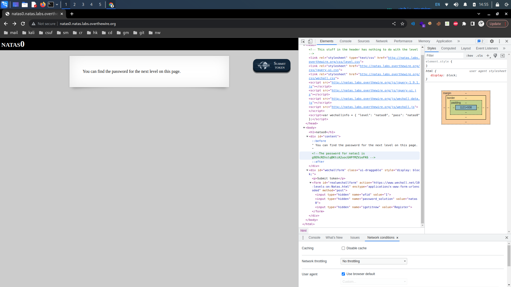
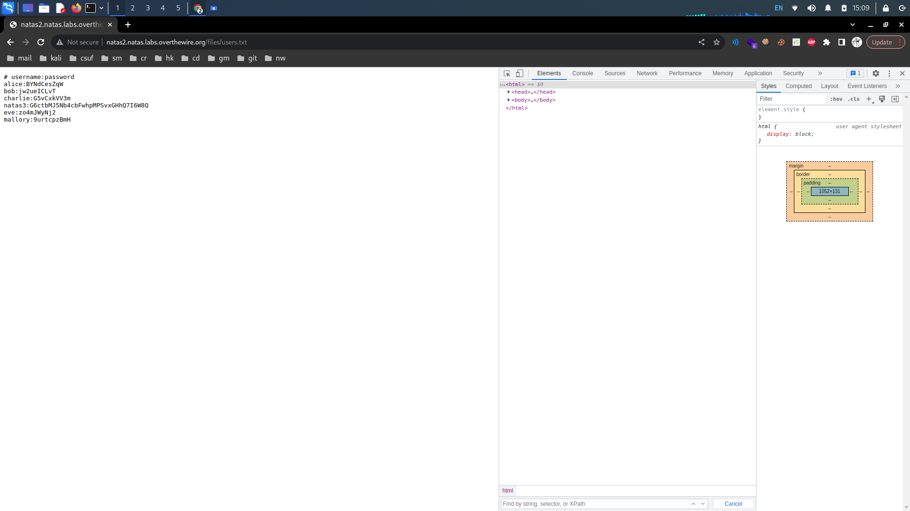
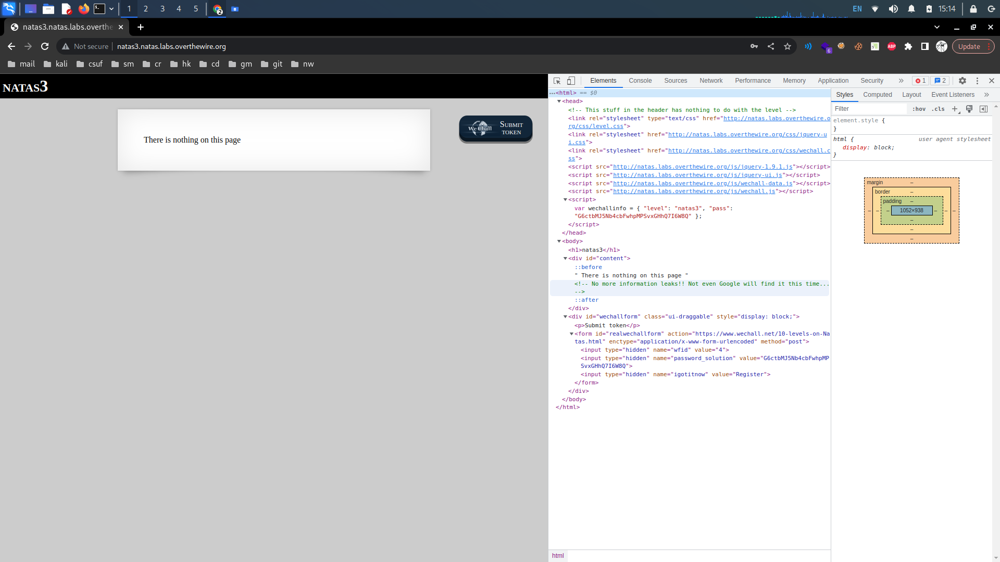
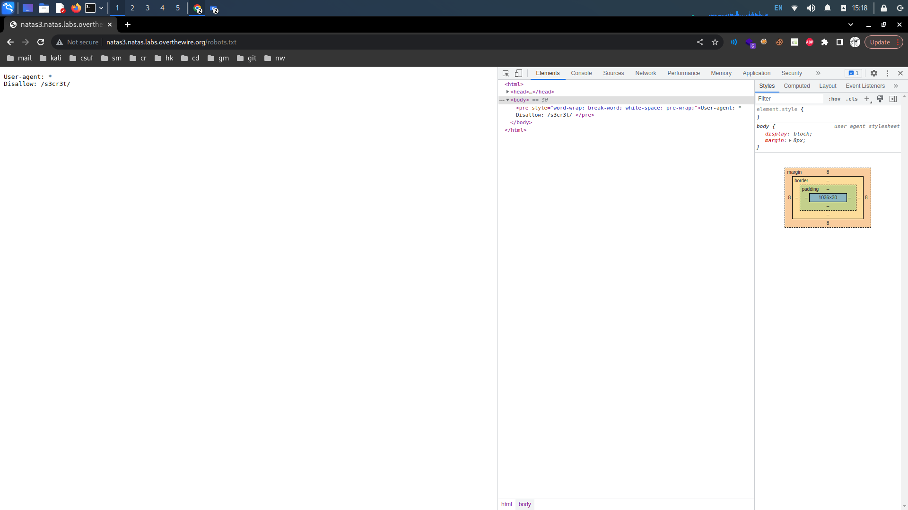
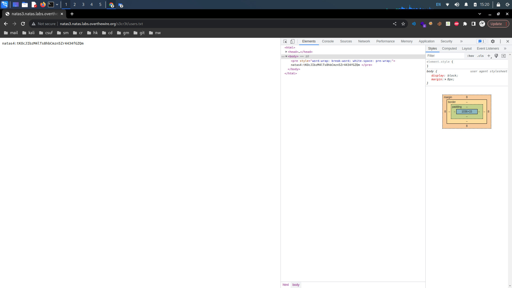
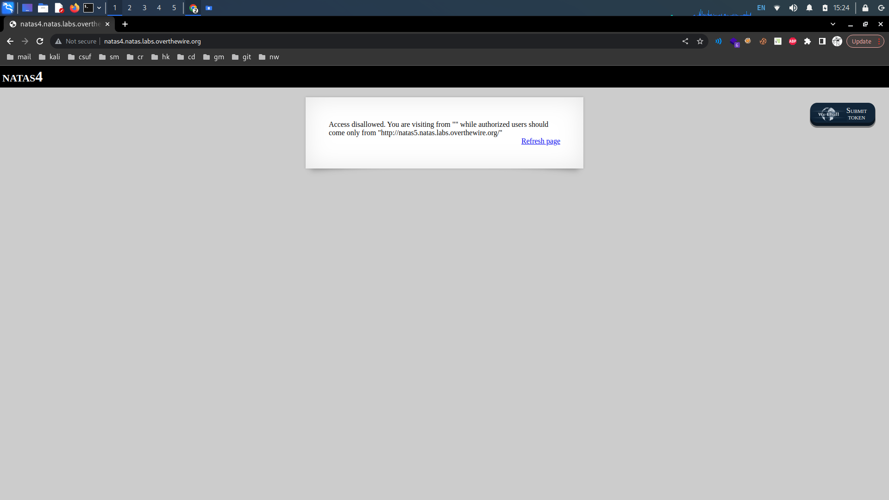
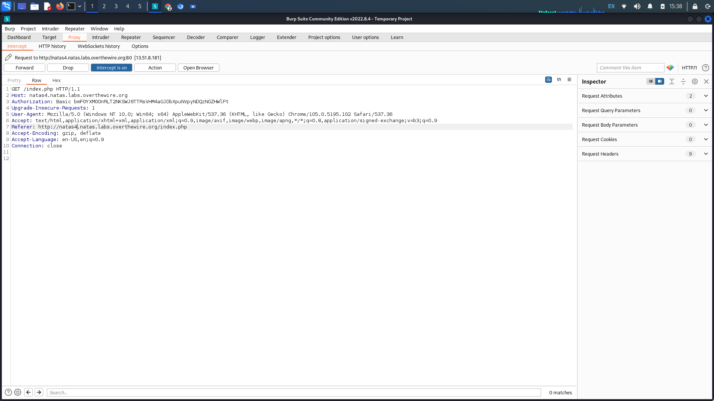
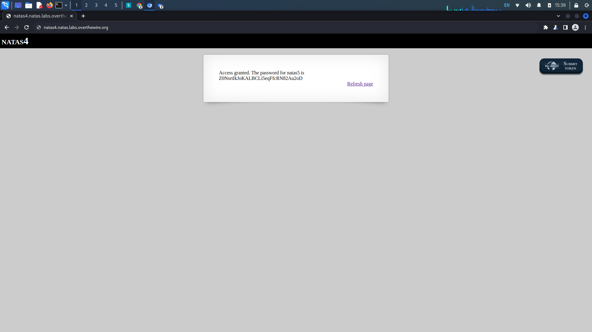

# OverTheWire: Natas 0->4

## Natas Level 0:

**Level Goal:**&#x20;

```
Username: natas0
Password: natas0
URL:      http://natas0.natas.labs.overthewire.org
```

It says we can find the password on this page. Start by inspect elementing the page, expand the HTML code by right clicking the \<html> tag and pressing "expand recursively". Under the "natas0" header we see the next level's password.

<figure><figcaption></figcaption></figure>


Navigate to the "Sources" tab or right click the page and press on view page source o copy the password for the next level.


<details>

<summary>Password:</summary>

g9D9cREhslqBKtcA2uocGHPfMZVzeFK6

</details>

## Natas Level 0->1:

**Level Goal:**&#x20;

```
Username: natas1
URL:      http://natas1.natas.labs.overthewire.org
```

On this level, it seems right-clicking on the page has been blocked. Use the shortcut, "ctrl + shift + i" to inspect element the page instead. Again, the index file has our password.

<figure><figcaption></figcaption></figure>

<details>

<summary>Password:</summary>

h4ubbcXrWqsTo7GGnnUMLppXbOogfBZ7

</details>

## Natas Level 1->2:

```
Username: natas2
URL:      http://natas2.natas.labs.overthewire.org
```

Inspecting the page source shows the use of pixel.png which is located in the /files directory.&#x20;

<figure><figcaption></figcaption></figure>

The files directory may contain more useful information other than just the png file. Change our directory to /files by adding it to our URL. Entering this directory shows us an additional users.txt file. Opening this file leads us to the password for the next level.

<figure><figcaption></figcaption></figure>

<details>

<summary>Password:</summary>

G6ctbMJ5Nb4cbFwhpMPSvxGHhQ7I6W8Q

</details>

## Natas Level 2->3:

```
Username: natas3
URL:      http://natas3.natas.labs.overthewire.org
```

Again, looking at the page source we see a comment stating "No more information leaks!! Not even Google will find it this time...".&#x20;

<figure><figcaption></figcaption></figure>

This makes reference to the robots.txt file. The robots text file tells search engine crawlers which directories they can "crawl" on. Hence why the comment makes reference to why even Google cannot find it. Lets navigate to the robots.txt directory.

<figure><figcaption></figcaption></figure>

We see all (\*) crawlers will not be able to crawl to /s3cr3t/ directory and its sub-directories. But we can manually navigate to these disallowed directories. In the secret page, we see a users.txt file that gives us our next password.

<figure><figcaption></figcaption></figure>

<details>

<summary>Password:</summary>

tKOcJIbzM4lTs8hbCmzn5Zr4434fGZQm

</details>

## Natas Level 3->4:

```
Username: natas4
URL:      http://natas4.natas.labs.overthewire.org
```

Upon connecting to the page, we see that we don't have access to view the site as we are not an authorized user. Instead it states we are visiting from "" an empty string.

<figure><figcaption></figcaption></figure>

Refreshing the page changes the empty string ("") to "[http://natas4.natas.labs.overthewire.org/](http://natas4.natas.labs.overthewire.org/)". This tells us the website is pulling the string from the referer header from our GET request. We can see this in real-time using [BurpSuite](https://portswigger.net/burp). Intercepting our page refresh shows us that the string displayed on the website matches the value of the referer header.


If we intercepted the initial website request, we see that the referer header is not present.


<figure><figcaption></figcaption></figure>

Change the referer header to where the website requires us to be visiting from ([http://natas5.natas.labs.overthewire.org/](http://natas5.natas.labs.overthewire.org/)) and forward the request. Returning to the browser, we are redirected to the page with the flag.

<figure><figcaption></figcaption></figure>

<details>

<summary>Password:</summary>

Z0NsrtIkJoKALBCLi5eqFfcRN82Au2oD

</details>
