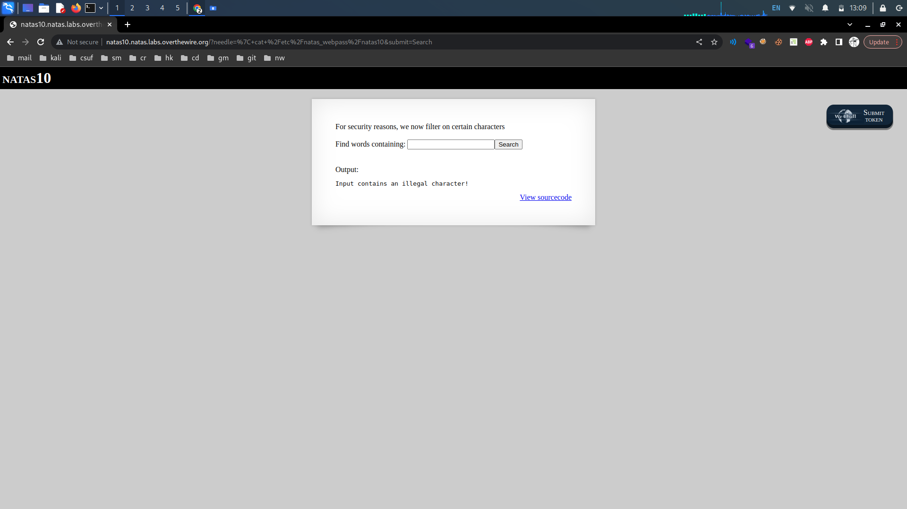
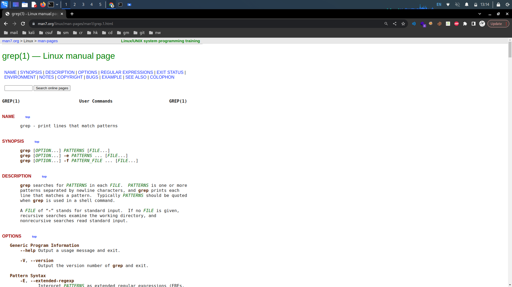

# OverTheWire: Natas 10->14

## Natas Level 9->10:

**Level Goal:**

```
Username: natas10
URL:      http://natas10.natas.labs.overthewire.org
```

**Writeup:** This level seems to be similar to the last level, this time our input will be filtered. We can confirm this by attempting our last payload again.

<figure><figcaption></figcaption></figure>

Looking at the source code it looks like the characters, "\[", ";", "|","&", and "]" are automatically filtered out.&#x20;


Note that the two forward slashes are not included, but act as a delimiter.


We need a payload that will not utilize these characters. Since grep is a string search utility, maybe we can alter it somehow.&#x20;

<figure><figcaption></figcaption></figure>

Looking at the grep manual, it looks like we can actually query multiple files. Before dictionary.txt is searched we could search our natas10 password file first.
