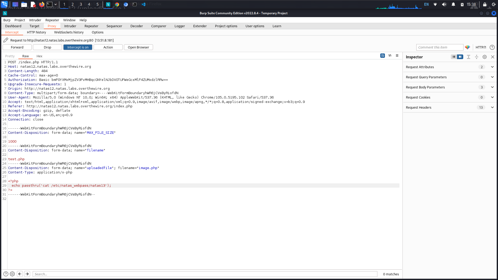
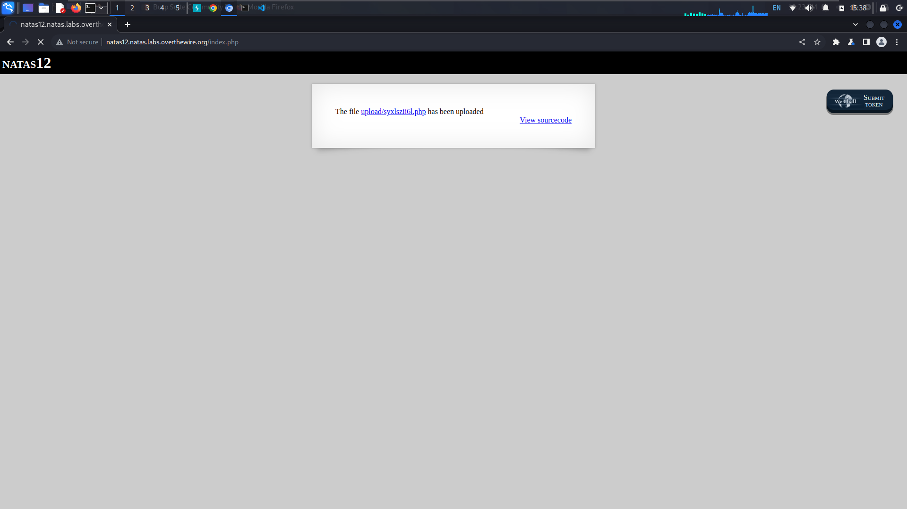
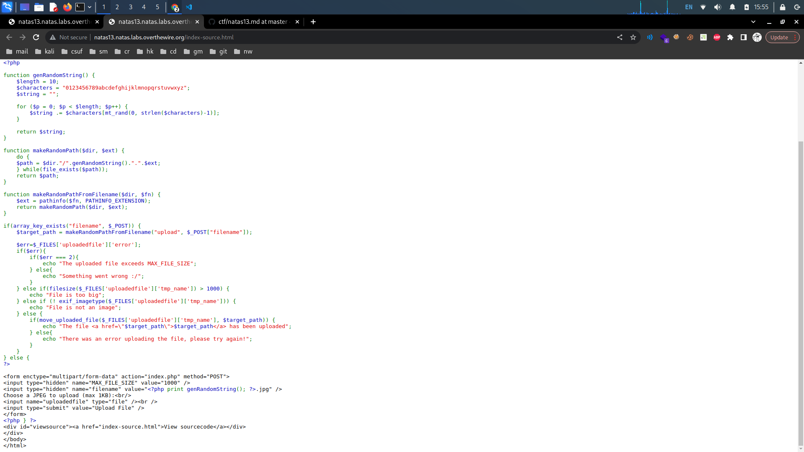

# OverTheWire: Natas 10->14

## Natas Level 9->10:

**Level Goal:**

```
Username: natas10
URL:      http://natas10.natas.labs.overthewire.org
```

**Writeup:** This level seems to be similar to the last level, this time our input will be filtered. We can confirm this by attempting our last payload again.

<figure><figcaption></figcaption></figure>

Looking at the source code it looks like the characters, "\[", ";", "|","&", and "]" are automatically filtered out.&#x20;


Note that the two forward slashes are not included, but act as a delimiter.


We need a payload that will not utilize these characters. Since grep is a string search utility, maybe we can alter it somehow.&#x20;

<figure><figcaption></figcaption></figure>

Looking at the grep manual, it looks like we can actually query multiple files. Before dictionary.txt is searched we could search our natas11 password file first.

```
PAYLOAD:
a /etc/natas_webpass/natas11

VISUALIZAION:
grep -i a /etc/natas_webpass/natas11 dictionary.txt
```


Now, the grep command looks for "a" in the natas11 password and returns any string containing it


Entering this payload gives us our password.

<figure><figcaption></figcaption></figure>

<details>

<summary>Password:</summary>

1KFqoJXi6hRaPluAmk8ESDW4fSysRoIg

</details>

## Natas Level 10->11:

**Level Goal:**

```
Username: natas11
URL:      http://natas11.natas.labs.overthewire.org
```

**Writeup:** We have an input that lets us change the hex color value of the background. Additionally, we are informed that the cookies are XOR encrypted. It looks like we are going to need to alter the cookies somehow to get the password. Lets first examine the source code.

<figure><figcaption></figcaption></figure>

In the source code notice this:

1. Array $defaultdata stores default values for showpassword at "no" and bgcolor at "#ffffff". We will need to change the showpassword value to "yes"
2. The xor\_encrypt function takes an input string and XOR encrypts it. It iterates over each character of the string and performs an XOR operation between the characters and the corresponding characters from the encryption key.
3. The encryption key is stored in the $key variable and the encrypted text is stored in the $outText variable and returned as the result.
4. The loadData() function then retrieves data from cookies and decrypts it using the xor\_encrypt function. If validated, it JSON decodes it and checks if it contains the showpassword and bgcolor keys. If the value of bgcolor matches a valid hex color code, it updates the corresponding values in $mydata. Finally, returning the loaded data.
5. The saveData() function takes the data array, converts it to JSON format using json\_encode(), encrypts the JSON string using xor\_encrypt(), and stores the encrypted data in a cookie.

We can repurpose the written code to decode our cookie, and re-encrypt it using the xor\_encrypt function to get our key.&#x20;

```php
<?php
$cookie = "MGw7JCQ5OC04PT8jOSpqdmkgJ25nbCorKCEkIzlscm5oKC4qLSgubjY="; // The encoded cookie value

function xor_encrypt($in) {
    $key = json_encode(array( "showpassword"=>"no", "bgcolor"=>"#ffffff")); // The encryption key as a JSON-encoded string
    $text = $in; // The input to be encrypted
    $outText = ''; // Variable to store the encrypted output

    // XOR encryption
    for($i=0; $i<strlen($text); $i++) {
        $outText .= $text[$i] ^ $key[$i % strlen($key)]; // XOR each character of the input with the corresponding character in the key
    }

    return $outText; // Return the encrypted output
}

print xor_encrypt(base64_decode($cookie)); // Decrypt the cookie value and print the result
?>
```

Running this php code gave the output, "KNHLKNHLKNHLKNHLKNHLKNHLKNHLKNHLKNHLKNHLK". We know our key is "KNHL" as it is the string that is repeated. Since now we know the key, we can copy the data array and xor\_encrypt functions to substitute our new values. This will return our new cookie that we can use to get the password.

```php
<?php  
$data = array( "showpassword"=>"yes", "bgcolor"=>"#ffffff");  // associative array with two key-value pairs

function xor_encrypt($in) {  
    $key = 'knhl';  // XOR encryption key
    $text = $in;  // input text to be encrypted
    $outText = '';  // variable to store the encrypted result
  
    for($i=0; $i<strlen($text); $i++) {  
        $outText .= $text[$i] ^ $key[$i % strlen($key)];  // XOR operation between each character of the input text and the corresponding character in the key
    }  
  
    return $outText;  // return the encrypted result
}  
  
echo base64_encode(xor_encrypt(json_encode($data)));  // encrypt the JSON-encoded array, encode the result using base64, and print it
?>

```

Running this code returns our encoded cookie that we can now replace our current cookie with to retrieve our password.

<figure><figcaption></figcaption></figure>

<details>

<summary>Password:</summary>

YWqo0pjpcXzSIl5NMAVxg12QxeC1w9QG

</details>

## Natas Level 11->12:

**Level Goal:**&#x20;

```
Username: natas12
URL:      http://natas12.natas.labs.overthewire.org
```

**Writeup:** In this level we have the ability to upload files to the website. Lets take a look at the source code.

<figure><figcaption></figcaption></figure>

It looks like the site is vulnerable to unrestricted file upload as it does not ensure that the user input file is in jpg format. The pathinfo function to extract the file extension from the user-supplied filename, does not validate or restrict the file extension to be specifically "jpg" or any other format. We can use Burpsuite to intercept and alter our requests. Intercept the request of inputting a test php file. Here we can alter the contents of the php file to read the natas13 password.

<figure><figcaption></figcaption></figure>

Forwarding our request shows us our file uploaded to the website.

<figure><figcaption></figcaption></figure>

Forwarding our request once more gives us the password for the next level.

<figure><figcaption></figcaption></figure>

<details>

<summary>Password:</summary>

lW3jYRI02ZKDBb8VtQBU1f6eDRo6WEj9

</details>

## Natas Level 12->13:

**Level Goal:**&#x20;

```
Username: natas13
URL:      http://natas13.natas.labs.overthewire.org
```

**Writeup:** This level looks very much like our last one. Looking at the source code, it looks like now, the site checks if our file is an image with the exif\_imagetype function&#x20;

<figure><figcaption></figcaption></figure>

Looking at the PHP manual of the [exif\_imagetype](https://www.php.net/manual/en/function.exif-imagetype.php) function, the function reads the first bytes of an image and checks its signature. It looks like we can create a php script that will read the password as long as we prepend the file with the JPG signature.

<figure><figcaption></figcaption></figure>

Echo the JPG signature to a test php file, then append the php script we used in our last challenge. Confirm our file is read as a jpg with the file command. Open Burpsuite to intercept our file upload request. Change our file extension from jpg to php and forward the request. We are then directed back to the page where we see our php file. Forwarding the next request will give us our password.

<figure><figcaption></figcaption></figure>

<details>

<summary>Password:</summary>

qPazSJBmrmU7UQJv17MHk1PGC4DxZMEP

</details>

## Natas Level 13->14:

**Level Goal:**&#x20;

```
Username: natas14
URL:      http://natas14.natas.labs.overthewire.org
```

**Writeup:** We are directed to a login page, attempting some default credentials directs us to a page that says "Access Denied". Lets look a the source code.

<figure><figcaption></figcaption></figure>

Here, we see the SQL query being made we also see that we are looking to log in as natas15. Using  the payload below, we are successfully logged in.

```
PAYLOAD:
username: natas15
password: 1" or "1=1
```

<figure><figcaption></figcaption></figure>

<details>

<summary>Password</summary>

TTkaI7AWG4iDERztBcEyKV7kRXH1EZRB

</details>
