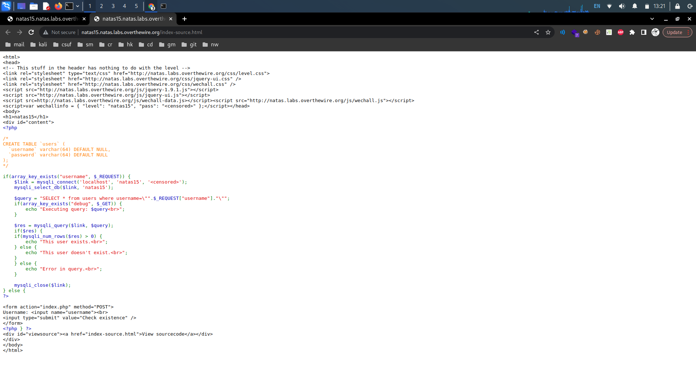
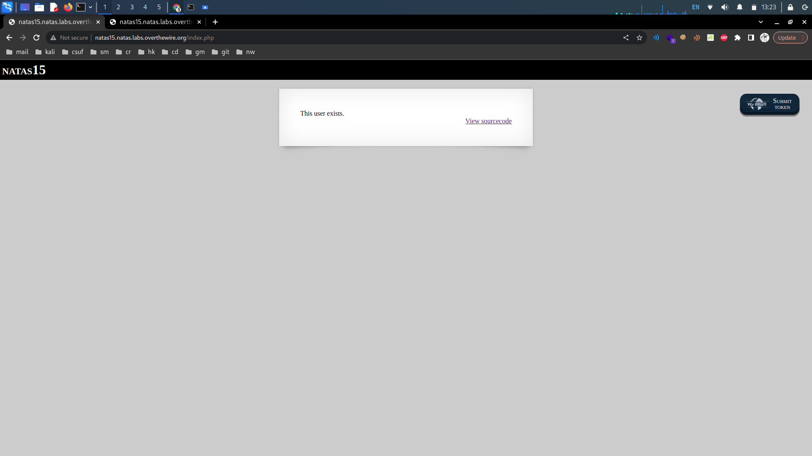

# OverTheWire: Natas 15->19

## Natas Level 14->15:

**Level Goal:**&#x20;

```
Username: natas15
URL:      http://natas15.natas.labs.overthewire.org
```

**Writeup:** Looking at the source code we are first given the table structure in the SQL database. Additionally, we see that the code checks if a user exists in the "users" table based on the provided username parameter.

<figure><figcaption></figcaption></figure>

We should note that the code is vulnerable to SQL injection attacks due to the direct inclusion of the $\_REQUEST\["username"] value in the query. Because we are looking for the password for the next level, entering the username of natas16 returns a result.

<figure><figcaption></figcaption></figure>

Knowing the structure of the table as well as the query being made, we can automate SQL injections to brute force the password.&#x20;
