# OverTheWire: Natas 5->9

## Natas Level 4->5:

**Level Goal:**&#x20;

```
Username: natas5
URL:      http://natas5.natas.labs.overthewire.org
```

**Writeup:** Upon visiting the natas5 website, we are denied access as we are not logged in.&#x20;

<figure>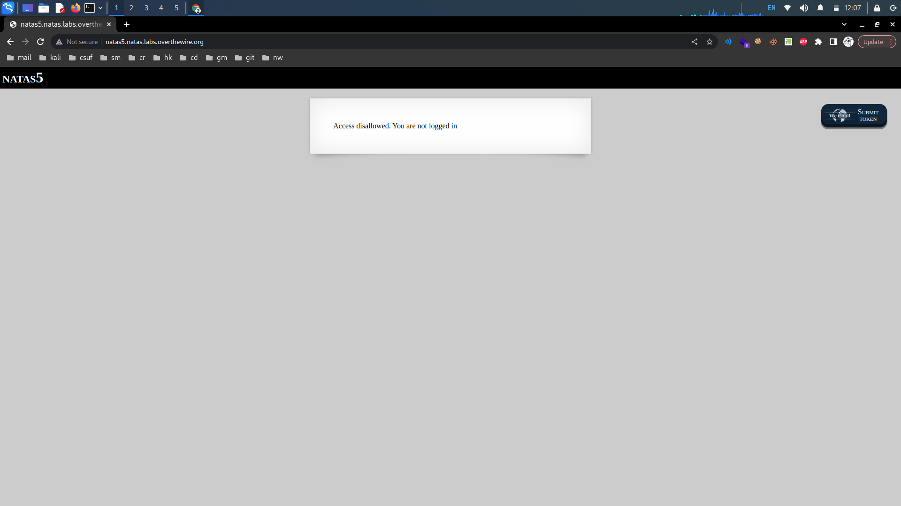<figcaption></figcaption></figure>

Examining the cookies stored in the site, we see a "loggedin" cookie with value 0.

<figure><figcaption></figcaption></figure>

Change the value of loggedin to 1 and save and refresh the page.&#x20;

<figure>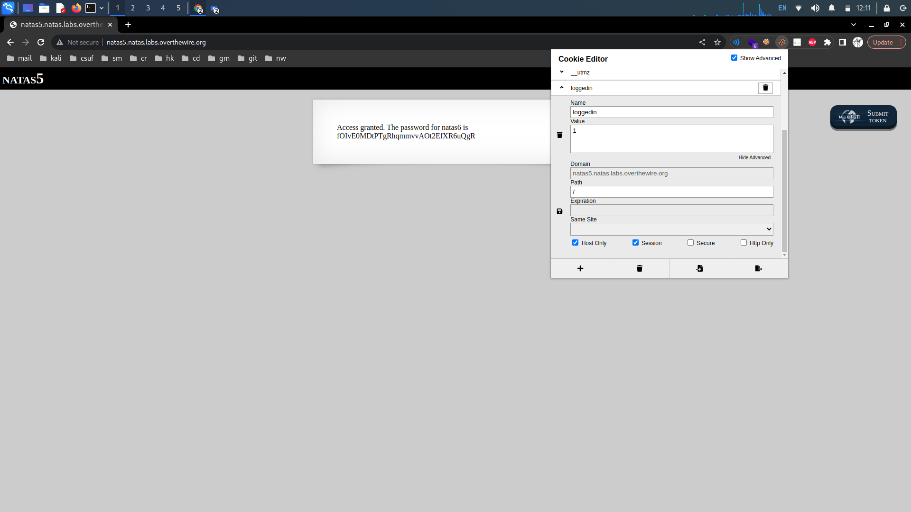<figcaption></figcaption></figure>

We are successfully logged in and given the password.

<details>

<summary>Password:</summary>

fOIvE0MDtPTgRhqmmvvAOt2EfXR6uQgR

</details>

## Natas Level 5->6:

**Level Goal:**

```
Username: natas6
URL:      http://natas6.natas.labs.overthewire.org
```

**Writeup:** It looks like we have to find a secret key. Attemping a test key prints "Wrong secret" on the current page.&#x20;

<figure><figcaption></figcaption></figure>

Lets take a look at the source code. It looks like our input is put in the array\_key\_exists function. If our input in our POST request does not equal the secret variable stored in /includes/secret.inc, the site prints "Wrong secret". Otherwise, we are given access.&#x20;

<figure>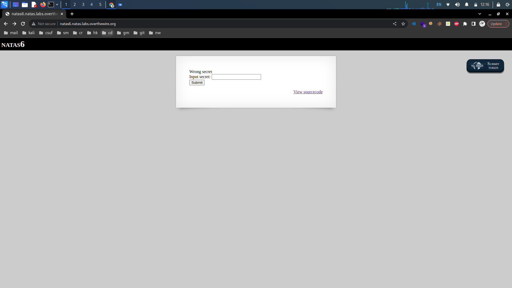<figcaption></figcaption></figure>

Since we are given the path and name of the file that contains the secret key, we can try to traverse there through the address bar. Navigating to the /includes/secret.inc file gives us the secret key.

<figure>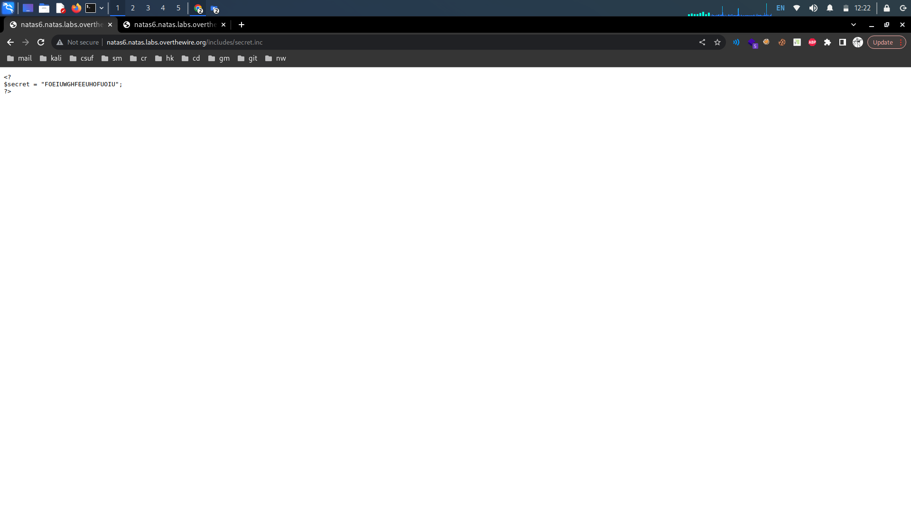<figcaption></figcaption></figure>

Enter the secret key and we are given the password.

<figure><figcaption></figcaption></figure>

<details>

<summary>Password: </summary>

jmxSiH3SP6Sonf8dv66ng8v1cIEdjXWr

</details>

## Natas Level 6->7:

**Level Goal:**

```
Username: natas7
URL:      http://natas7.natas.labs.overthewire.org
```

**Writeup:** Looking at the page source we see a comment giving us the directory where we can find the password.

<figure>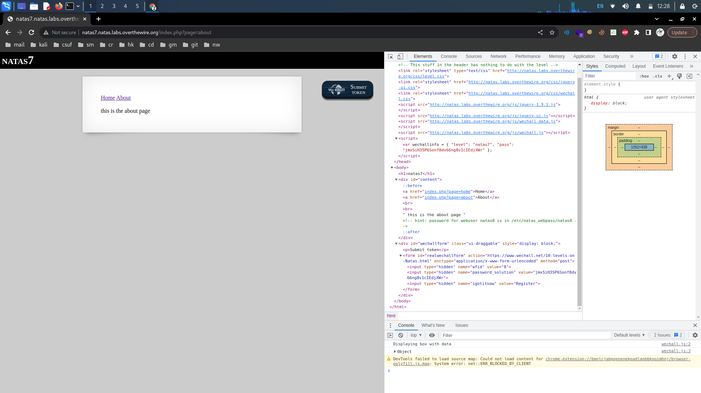<figcaption></figcaption></figure>

Being on the home or about page seems to change our page value. Since we know what page we want to be on now, we can change our page value to our given destination. This takes us to the password.

<figure>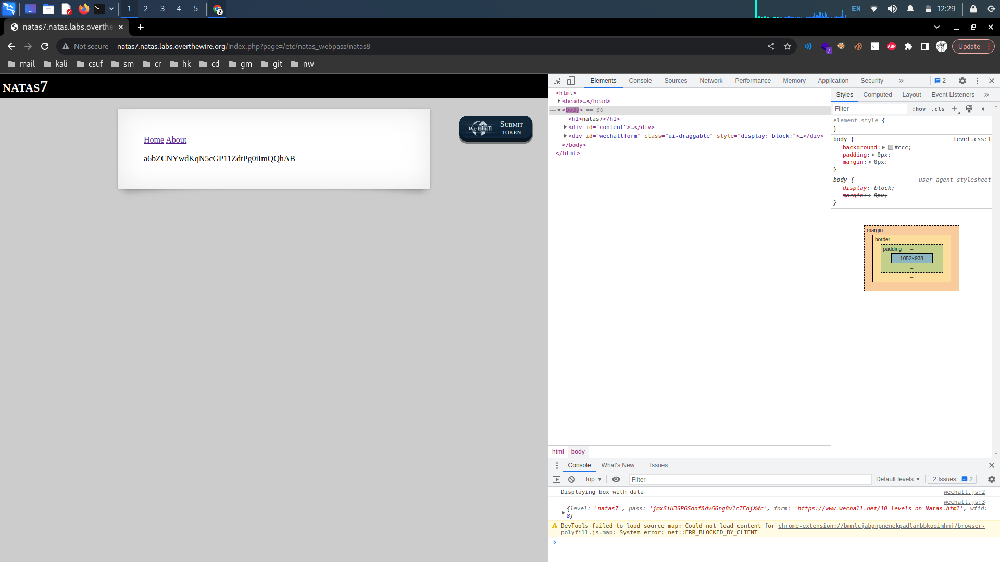<figcaption></figcaption></figure>

<details>

<summary>Password:</summary>

a6bZCNYwdKqN5cGP11ZdtPg0iImQQhAB

</details>

## Natas Level 7->8:

**Level Goal:**&#x20;

```
Username: natas8
URL:      http://natas8.natas.labs.overthewire.org
```

**Writeup:** Like in [#natas-level-5-greater-than-6](overthewire-natas-5-greater-than-9.md#natas-level-5-greater-than-6 "mention") we need to find the secret key. Again, open the source code for the site.&#x20;

<figure>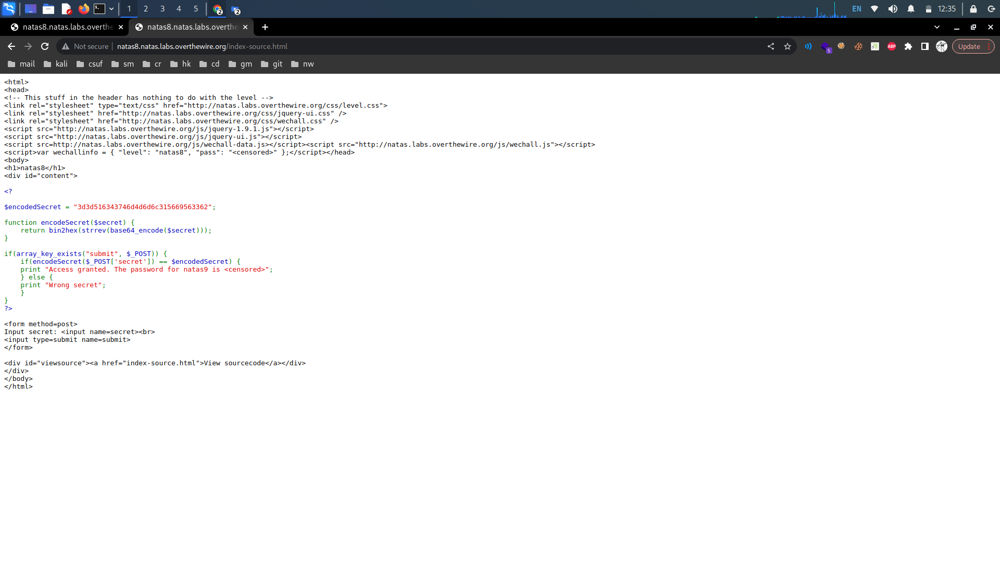<figcaption></figcaption></figure>

It looks like the encodedSecret function base64 encodes the key and converts the binary data to hex. We can also see the value of the encoded secret variable. We can decode the encoded secret by decoding the string in reverse order. We can start by converting the encoded secret from hexadecimal form to text form as the last function applied to our encoded string is the bin2hex which converts binary data to its hexadecimal representation.

<figure>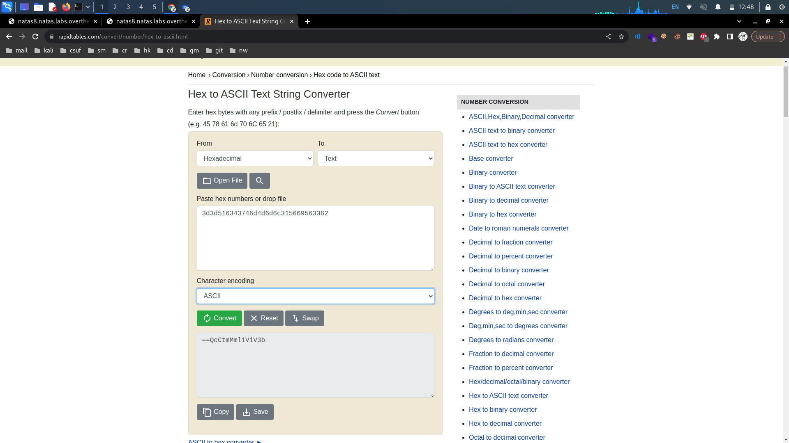<figcaption></figcaption></figure>

Our next function is the strrev function. This function reverses our encoded secret string. We can easily search up a string reverser and reverse our binary string.

<figure>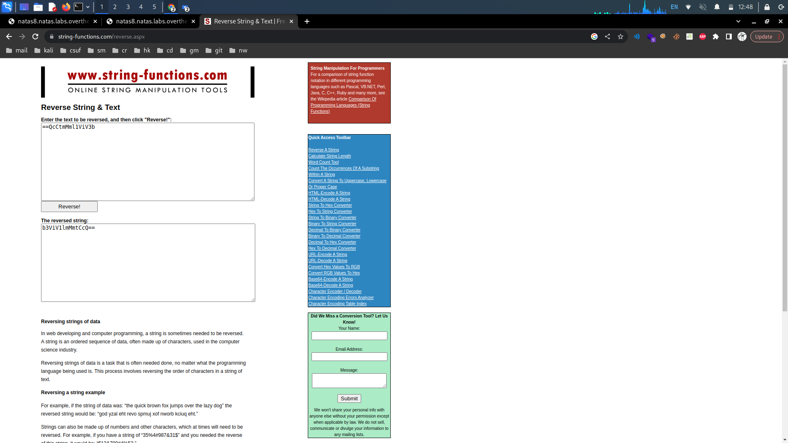<figcaption></figcaption></figure>

Our last function is the base64 encoding. We can base64 decode our binary data to get our secret key.

<figure>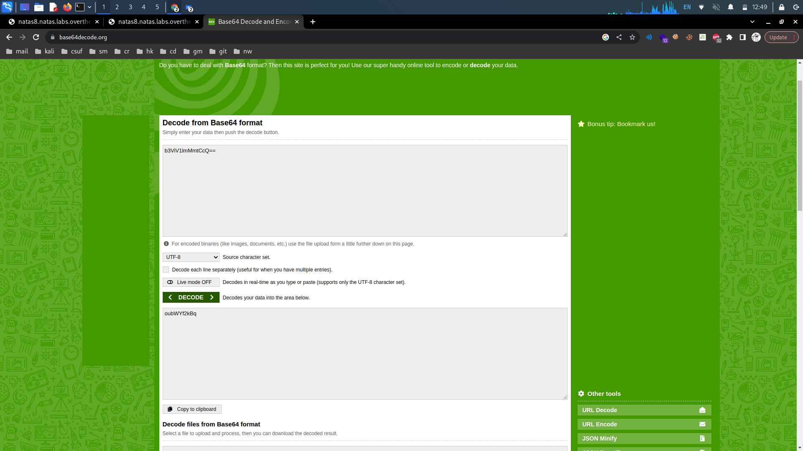<figcaption></figcaption></figure>

Input our secret key and we are given the password.

<figure>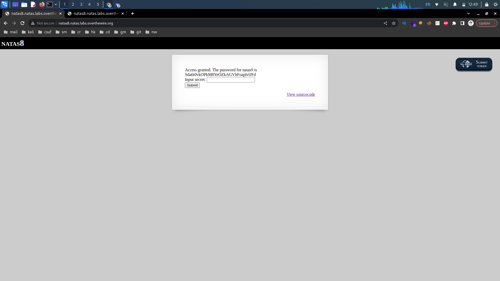<figcaption></figcaption></figure>

<details>

<summary>Password:</summary>

Sda6t0vkOPkM8YeOZkAGVhFoaplvlJFd

</details>

## Natas Level 8->9:

**Level Goal:**

```
Username: natas9
URL:      http://natas9.natas.labs.overthewire.org
```

**Writeup:** We have a text input field that seems to return words containing our input from some sort of dictionary. Viewing the source code , it looks like our input is passed in as the variable key through dictionary.txt through the passthru function.

<figure>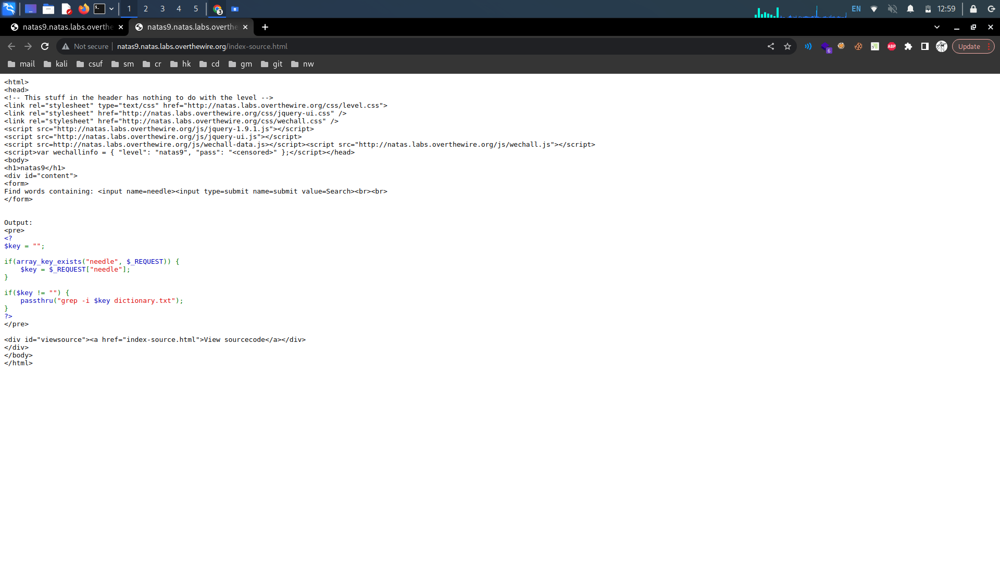<figcaption></figcaption></figure>

It looks like we can execute shell commands through passthru seeing that it is used in this context to grep (print) strings in dictionary.txt that match our input. Inputting a command will start it after the grep -i which is not what we want. We can start a new command with a pipe ("|").

```
PAYLOAD:
| cat /etc/natas_webpass/natas10

VISUALIZATION:
grep -i | cat /etc/natas_webpass/natas10 dictionary.txt
```


grep -i returns nothing, instead the pipe starts another command.


Entering this payload gives us the password also printing the entire dictionary.

<figure>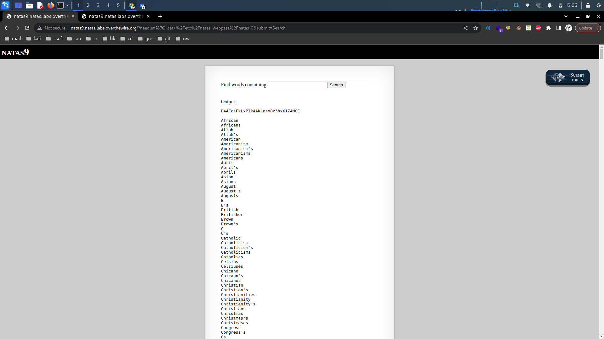<figcaption></figcaption></figure>

<details>

<summary>Password:</summary>

D44EcsFkLxPIkAAKLosx8z3hxX1Z4MCE

</details>
